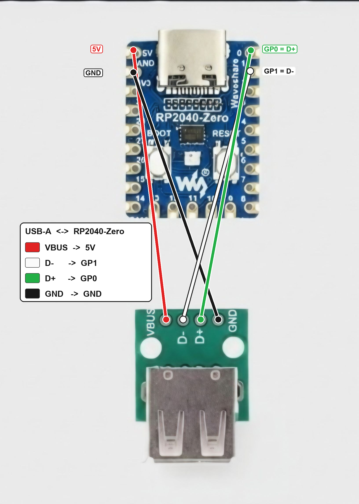
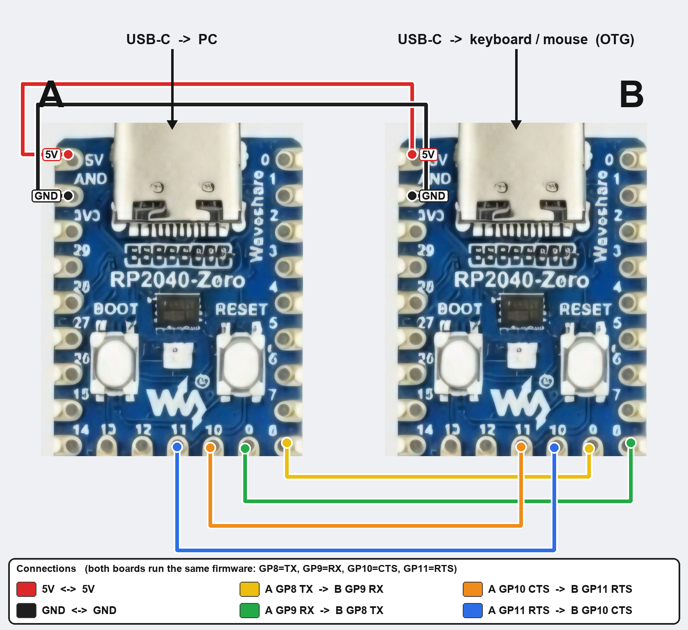

# HID Remapper VX - Visual Enhanced

A visually enhanced fork of [jfedor2/hid-remapper](https://github.com/jfedor2/hid-remapper) with a dark-themed config tool, visual Expression Builder, Quick Actions, and Example Configs for Android TV, Browser, and Windows remapping.

## Live Config Tool

**[Open Configuration Tool](https://qutaiba-khader.github.io/hid-remapper-vx/)**

Use Chrome or a Chromium-based browser (WebHID required).

## What This Fork Adds

- **Dark theme UI** optimized for readability
- **Categorized Android TV usages** (Power, Navigation, Media, Volume, Apps, System)
- **Example Configs** as color-coded categorized cards (Keyboard, Mouse, Macros, Expressions, Windows)
- **Expression Builder** - visual block-based editor (powered by Google Blockly) for building RPN expressions without writing code
  - Categorized toolbox: Input, Logic, Math, Memory, Time, Trig/Advanced
  - Unified input picker with all mouse, keyboard, and gamepad inputs in one dropdown
  - RPN parser that loads existing expressions back into visual blocks when clicking Edit
  - Close confirmation dialog to prevent losing work
- **Expression UX** - snippets dropdown, copy/paste buttons, and Edit button linking to the visual builder
- **Drag-and-drop reorder** for mappings
- **Improved UX** for Sticky/Tap/Hold with clear help text and tooltips
- **Android TV HID descriptor** (firmware) with Consumer Control outputs for all standard remote keys

## Bluetooth input (Pico W)

A **Pico W** can take its input over **Bluetooth LE** instead of a USB cable: pair a BLE keyboard,
mouse or TV remote, and it runs through the **full mapping engine** (layers, macros, expressions,
quirks) and out to the PC as an ordinary USB HID device. The PC sees a **HID Remapper**, not your
remote — which is the whole point.

Download **`remapper_picow_ble.uf2`** from the config tool's **Actions → Bluetooth** section.

- **Auto-connects to its paired device, always** — and once paired it will **never** bond with
  anything else. A remote that is switched off or out of range does not leave it open to the room.
- **Not paired yet?** It is pairable — that is first-time setup.
- **Pair a different device:** *Pair new device* in the config tool opens a **3-minute** window.
- The build has **no serial output** (it is a HID device), so the onboard **LED is the status**:
  **solid** = connected · **fast blink** = connecting · **double blink** = pairing window open ·
  **slow blink** = idle.

A **BLE HID device serves its HID service to ONE bonded host.** If your remote is still paired to a
TV or a phone, it will accept the connection and then refuse to talk — re-pair it. That is a property
of the remote, not a bug in the firmware.

## How It Works

This is a USB HID remapper that sits between your remote's USB receiver and the Android TV device. It intercepts HID input events and remaps them according to your configuration — entirely in hardware, no host software needed.

## Single-board wiring (RP2040-Zero / RP2350-Zero + USB-A)

The board's own USB-C connects to the host. A USB-A port for the device you want to remap (keyboard/mouse/receiver) is wired to four pads using the standard USB wire colors:

| USB-A pin | Wire color | Board pad |
|-----------|-----------|-----------|
| VBUS | 🔴 red | **5V** |
| D− | ⚪ white | **GP1** |
| D+ | 🟢 green | **GP0** |
| GND | ⚫ black | **GND** |

Notes:
- The PIO USB host is fixed to the **GP0 (D+) / GP1 (D−)** pair — they must stay adjacent and cannot be moved.
- **5V = VSYS = VBUS**, tied to the board's USB-C VBUS, so it supplies bus power out to the attached device.
- Flash the plain `remapper.uf2` for the **RP2040-Zero** (or `remapper_rp2040_zero_led.uf2` for onboard RGB LED control), or `remapper_pico2.uf2` (or `remapper_pico2_led.uf2` for onboard RGB LED) for the **RP2350-Zero**.

See **[RP2040-ZERO.md](RP2040-ZERO.md)** for the full RP2040-Zero / RP2350-Zero reference (pinout, every firmware file, single + dual + RGB LED, building from source).

## Dual-board wiring (two RP2040-Zero boards)

The **dual-Pico** build uses two RP2040-Zero boards and has **better device compatibility** than the single-board build: Board B reads your keyboard/mouse through the RP2040's *real hardware USB host* instead of the bit-banged PIO-USB, so devices (and USB hubs) that don't work on the single build often work here.

The two boards talk to each other over a UART link. On the RP2040-Zero the stock UART pins (GP20/GP21) are on the hard-to-reach underside pads, so this build moves the link to the edge-accessible **UART1 pins GP8/GP9/GP10/GP11**.

**Six wires between the two boards:**

| Board A (→ PC) | Board B (→ input devices) |
|----------------|---------------------------|
| 5V | 5V |
| GND | GND |
| GP8 (TX) | GP9 (RX) |
| GP9 (RX) | GP8 (TX) |
| GP10 (CTS) | GP11 (RTS) |
| GP11 (RTS) | GP10 (CTS) |

- **Board A** → your computer, via its USB-C port. Flash it with **`remapper_rp2040_zero_dual_a_led.uf2`** — this build also drives Board A's onboard WS2812 RGB LED (GP16) as a mappable target (Board A runs the mapping engine). A plain non-LED **`remapper_rp2040_zero_dual_a.uf2`** is also available.
- **Board B** → your keyboard/mouse, through a **USB-C OTG adapter** on its USB-C port (native USB host — no USB-A breakout or GP0/GP1 wiring is used in the dual build). Flash it with **`remapper_rp2040_zero_dual_b.uf2`**.
- Flash each board separately (hold BOOTSEL, plug in, drag the `.uf2` to the drive). There's no combined single-flash image — the RP2040-Zero doesn't expose its SWD port, and you don't need it.

Downloads: [Board A (+ LED)](https://github.com/Qutaiba-Khader/hid-remapper-vx/releases/latest/download/remapper_rp2040_zero_dual_a_led.uf2) · [Board B](https://github.com/Qutaiba-Khader/hid-remapper-vx/releases/latest/download/remapper_rp2040_zero_dual_b.uf2)

## Quick Start

1. Flash the appropriate firmware to your RP2040-based board (see [original docs](https://github.com/jfedor2/hid-remapper#how-to-make-the-device))
2. Open the [config tool](https://qutaiba-khader.github.io/hid-remapper-vx/)
3. Click **Open device** to connect via WebHID
4. Use the **Quick Actions** tab for common Android TV mappings and example configs
5. Use the **Expression Builder** (click Edit on any expression field) to visually create expressions
6. Click **Save to device** when done

## Acknowledgments

This project is built upon the excellent work of **[Jacek Fedorynski](https://github.com/jfedor2)** and the [HID Remapper](https://github.com/jfedor2/hid-remapper) project. The original HID Remapper provides a robust, well-engineered hardware remapping platform with support for multiple RP2040 and nRF52840 boards, comprehensive HID protocol handling, and a powerful expression engine. Without that solid foundation, this Android TV-focused customization would not be possible.

For full documentation on hardware setup, firmware compilation, and the complete feature set, please visit the original project at [remapper.org](https://www.remapper.org/).

## License

The software in this repository is licensed under the [MIT License](LICENSE), unless stated otherwise.

The hardware designs in this repository are licensed under the Creative Commons Attribution 4.0 International license ([CC BY 4.0](https://creativecommons.org/licenses/by/4.0/)), unless stated otherwise.
